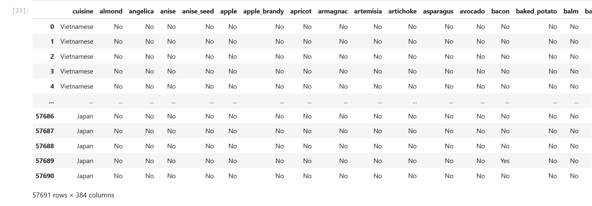
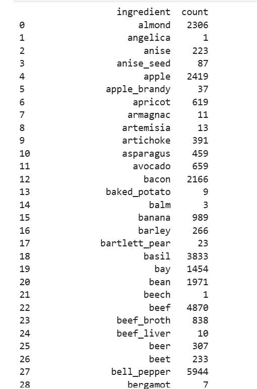
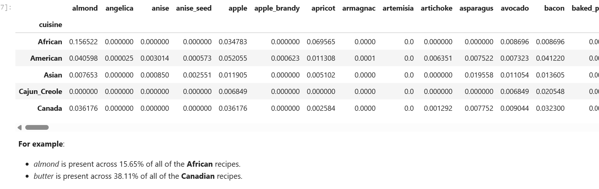
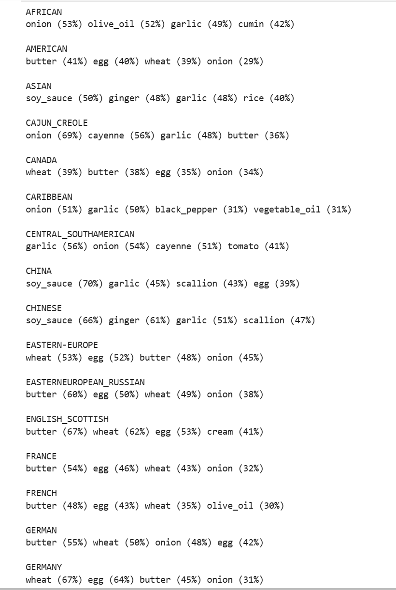

# Data understanding and preparation. Cuisine ingredients 

> Python, Jupyter Lab, Python Notebook, pandas, regular expressions, data understanding, data preparation, data analysis, data science

Analyzing thousands of food recipes (cuisines and ingredients) in a csv file to determine the different ingredients used by each cuisine 

**Counting ingredients used into the recipes**

**Percentage of the ingredients used by cuisine**

**Top 4 ingredients per cuisine**

